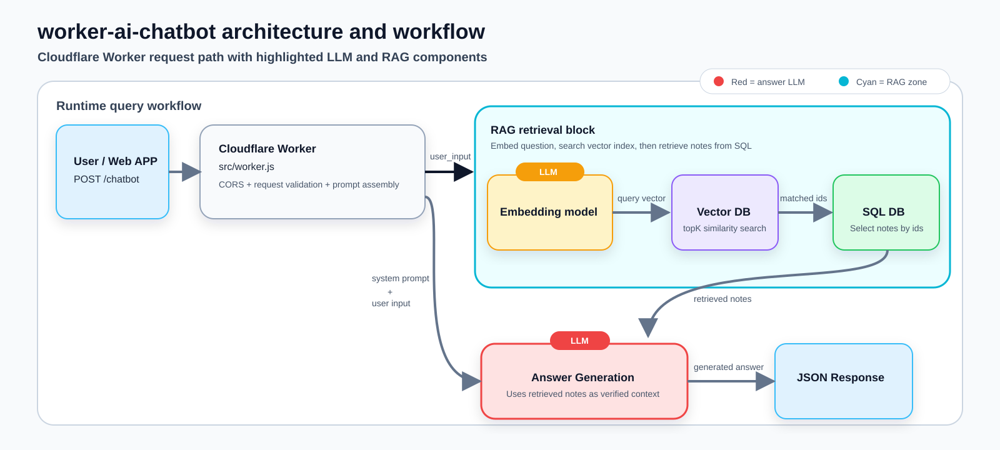

# Personal AI Chatbot — RAG on Cloudflare Edge

This project is an LLM-powered chatbot with a custom RAG system, deployed on Cloudflare's edge network. Check out the live demo at [chienliu.com](https://chienliu.com) — the chatbot can answer questions about the author, Chien Liu :smiley_cat:

## Tech stack


- **Cloudflare Workers**: Edge runtime hosting the chatbot API
- **Workers AI**: LLM inference for chat responses
- **D1**: Relational store for RAG note metadata
- **Vectorize**: Vector store for RAG embeddings/retrieval
- **Workflows**: Orchestrates the RAG note sync process
- **Hono**: Lightweight router for the Worker

## Architecture diagram



## Cloudflare deployment

- This repository is integrated with Cloudflare Workers.
- The deployed Worker is built from the code in `src/`, with `src/worker.js` as the entrypoint.
- The production route is `https://api.chienliu.com/chatbot`.
- The local maintenance assets in `notes/` and `scripts/` support RAG content management, but they are not the Worker code that gets deployed from `src/`.

## How it manages RAG

- Each markdown file in `notes/` is the source of truth for one RAG note.
- The filename must follow this format:

```text
${id}_${name_for_human_editor}.md
```

Examples:

```text
1_chiens_work_experience.md
2_projects.md
15_publications.md
```

- `${id}` must be a positive integer.
- The sync script normalizes the filename ID before sending it to the API.
- The resulting ID is reused as the note ID in D1 and Vectorize.
- Remote note writes happen through `PUT /notes/:id` (local only) with a JSON body shaped like `{ "text": "..." }`. In production, only `/chatbot` requests reach the Worker, so `/notes/:id` is unreachable at the edge.
- Renaming or deleting local files affects remote data on the next sync.

## Workflow: Update RAG notes

1. Create or edit markdown files in `notes/`.
2. Copy `.env.local.example` to `.env.local` (first time only):

```bash
cp .env.local.example .env.local
```

3. Start the local Worker:

```bash
npx wrangler dev
```

4. In another terminal, run the sync:

```bash
npm run sync:notes
```
The workflow may take a moment to process. Monitor the `npx wrangler dev` output to confirm the upload has completed.

## Sync behavior

The sync script is `scripts/sync-rag-notes.sh`.

It will:

1. Scan `notes/` for `*.md` files.
2. Validate that every filename matches `${id}_*.md`.
3. Compute a SHA-256 hash for each file.
4. Upload only notes whose content changed since the last successful sync.
5. Delete remote notes whose IDs existed in the previous sync state but no longer exist locally.
6. Save sync state in `.rag-sync-state`.

Because of this behavior:

- Editing a file updates the remote note
- Adding a file creates a remote note
- Deleting a file deletes the remote note
- Changing only the human-readable suffix keeps the same remote note if the numeric ID stays the same

## Troubleshooting

- `Missing env variable`: ensure `.env.local` exists and contains `ADMIN_API_ENABLED=true`.
- `Notes directory not found`: create `notes/` or set `RAG_SYNC_NOTES_DIR`.
- `Invalid note filename`: rename the file to `${id}_name.md`.
- `Duplicate note id`: ensure only one markdown file uses each numeric ID.

## Notes on safety

`wrangler dev` in this project is configured with remote Cloudflare bindings. A live sync updates the bound D1 and Vectorize resources, so use the sync flow carefully.
